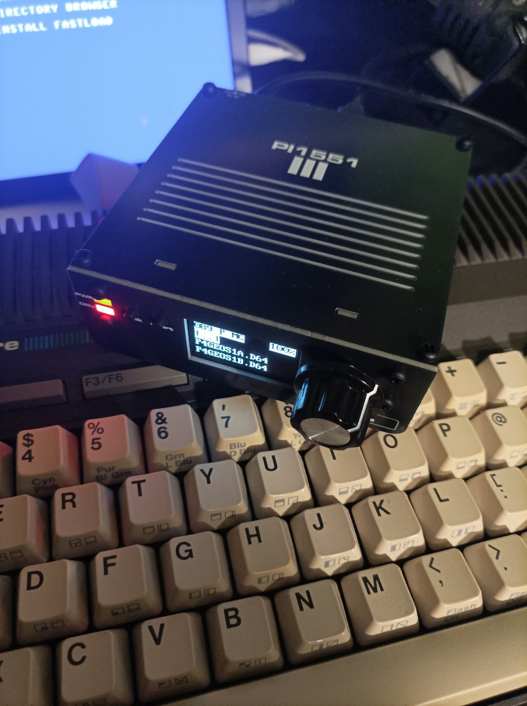
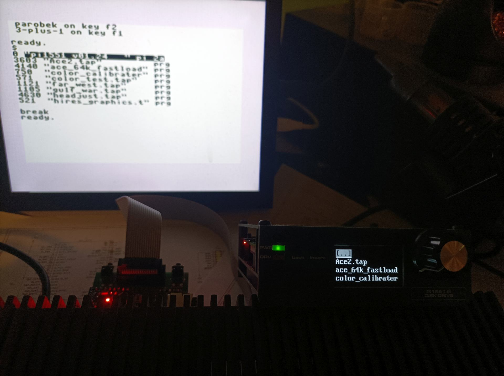
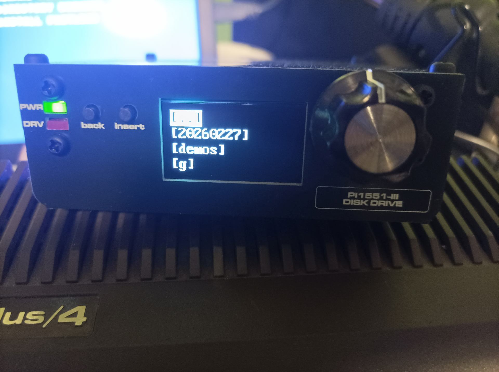
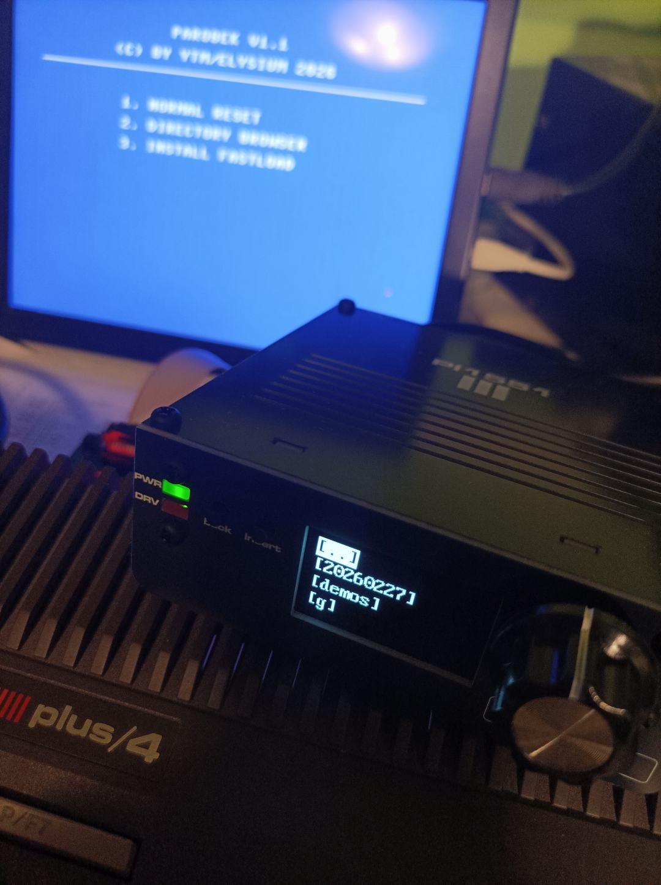
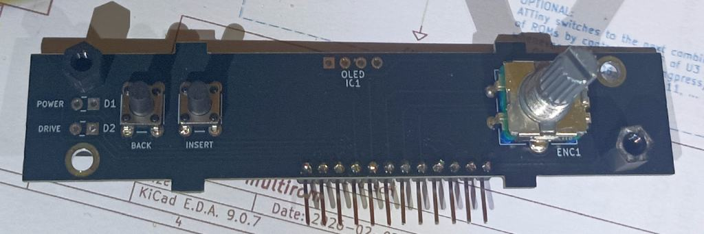
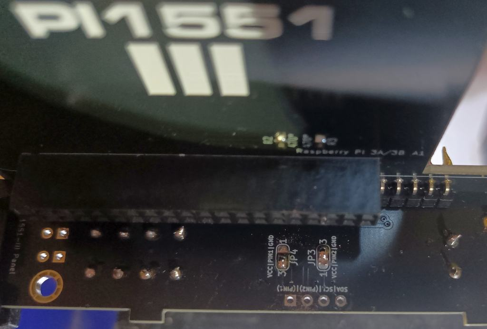
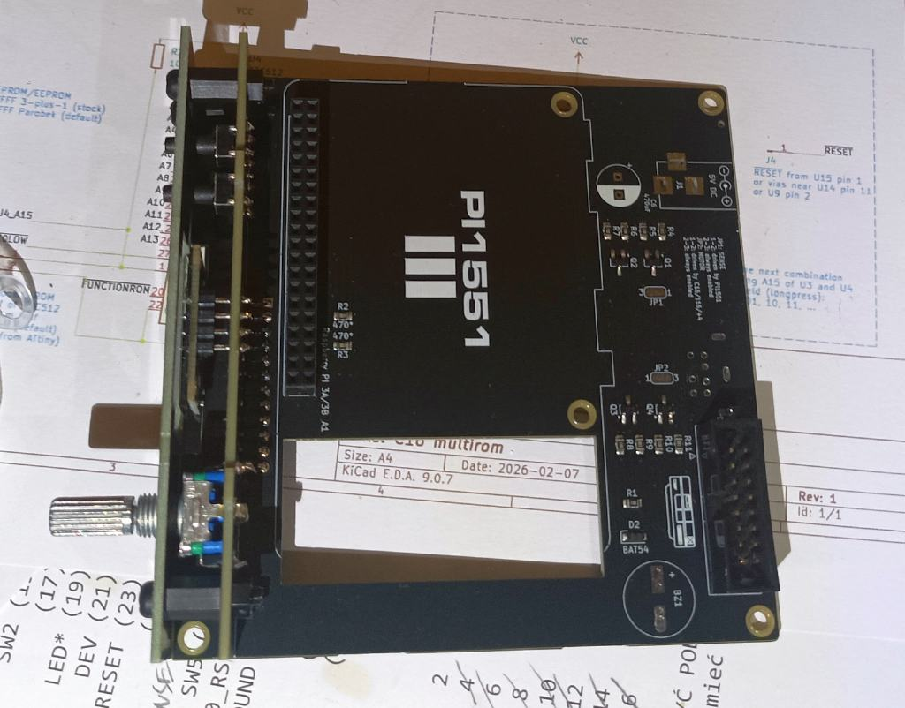
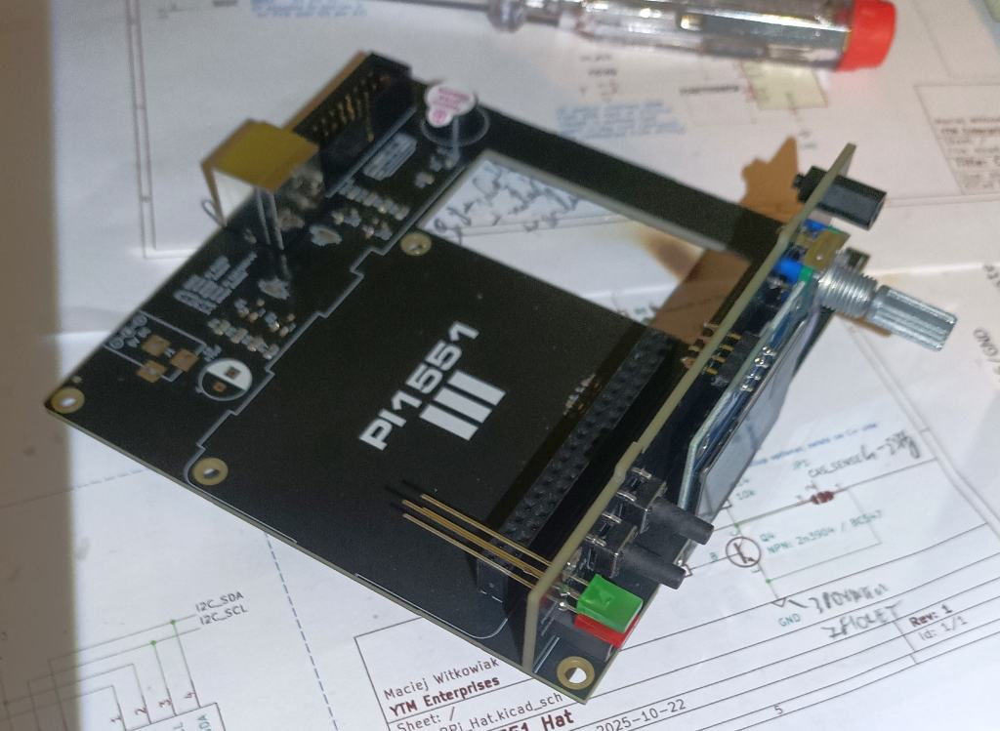
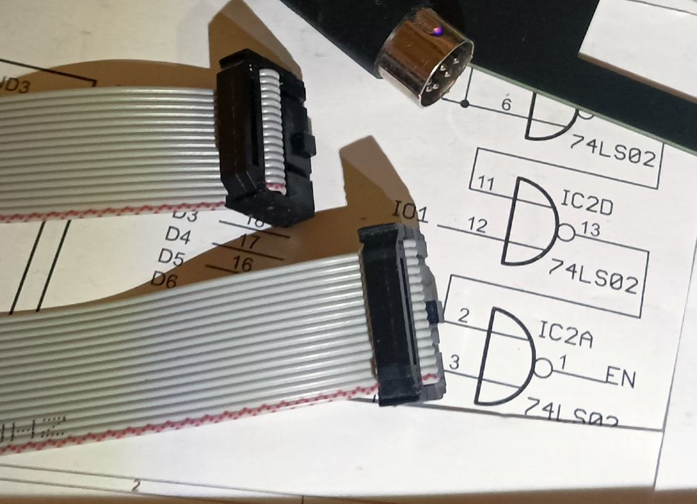

# Pi1551-III

A **1551 floppy emulator** for Commodore C16, C116 and Plus/4, in the same mechanical and aesthetic package as the [C64 Pi1541-III](https://github.com/tebl/C64-Pi1541-III): Raspberry Pi 3–based, 1.3" OLED, rotary encoder, and stack of PCBs with faceplates. 

This variant uses the **[Pi1551](https://github.com/ytmytm/Pi1551)** firmware and connects to the computer via **[tcbm2sd](https://github.com/ytmytm/plus4-tcbm2sd)** (TCBM bus). It also adds a **MiniDIN-7** port for **TAP tape playback** with a simple 1:1 male-to-male cable to the machine’s tape port.

> **WARNING — tcbm2sd only**  
> This device must **only** be connected to a **tcbm2sd** adapter. **Do not** connect it to an original 1551 paddle or any other 5 V bus. The interface is **not 5 V tolerant** and can damage the Raspberry Pi and the computer.

---

**Build files:** Gerbers for every board, plus BOM and SMD position files for the main module (Pi1551-III Module-rotated), are published in the **[Releases](https://github.com/ytmytm/Pi1551-III/releases)** section of this repository.

If you prefer a smaller, simpler board: see **[Pi1551-HAT](https://github.com/ytmytm/Pi1551-HAT)** for a minimal Raspberry Pi HAT with the same 1551 + TAP functionality with several features optional.

---

- [1. Modules](#1-modules)
- [2. Differences from Pi1541-III](#2-differences-from-pi1541-iii)
- [3. Assembly](#3-assembly)
- [4. Cables](#4-cables)
- [5. Documentation](#5-documentation)
- [6. Resources](#6-resources)
- [7. Acknowledgements](#7-acknowledgements)

## 1. Modules

A complete Pi1551-III uses the same five-PCB stack as the Pi1541-III. Assembly and mechanical steps are almost identical, so **use the original project’s gallery and docs** for visual guidance:

- **[C64-Pi1541-III gallery](https://github.com/tebl/C64-Pi1541-III/tree/main/gallery)** — build photos, side views, and assembly reference.

(side view of Pi1541-III, almost identical to Pi1551-III)

| Module | Required | Description | Documentation | Build files |
|--------|----------|-------------|---------------|------------|
| [Pi1551-III Module-rotated](Pi1551-III%20Module-rotated) | Yes | Main module: RPi 3, TCBM interface, optional power area (see below), MiniDIN-7 for TAP. | [BOM](Pi1551-III%20Module-rotated/README.md#3-bom) | [Releases](https://github.com/ytmytm/Pi1551-III/releases) |
| [Pi1551-III Module Panel](Pi1551-III%20Module%20Panel) | Yes | Front panel: OLED, rotary encoder, switches. | [BOM](Pi1551-III%20Module%20Panel/README.md#3-bom) | [Releases](https://github.com/ytmytm/Pi1551-III/releases) |
| [Pi1551-III Faceplate (FB1)](faceplates/Pi1551-III%20Module%20FB1) | Yes | Top faceplate; mechanical support for front panel. | — | [Releases](https://github.com/ytmytm/Pi1551-III/releases) |
| [Pi1551-III Faceplate (FB2)](faceplates/Pi1551-III%20Module%20FB2) | Recommended | Bottom faceplate; protects from shorts. | — | [Releases](https://github.com/ytmytm/Pi1551-III/releases) |
| [Pi1551-III Faceplate (FP1)](faceplates/Pi1551-III%20Module%20FP1) | Recommended | Front faceplate; cosmetic. | — | [Releases](https://github.com/ytmytm/Pi1551-III/releases) |

Each module’s BOM is in its README. For the main module, Gerbers, BOM and position files for SMD parts only are also in **Releases** for easy fabrication (e.g. JLCPCB).

## 2. Differences from Pi1541-III

- **Main module (“rotated”)**  
  The Raspberry Pi footprint is **rotated 180°** so **USB and HDMI are accessible** on the outside. I recommend **not** fitting the barrel jack (J1) or the 470 µF capacitor (C6): power the device from the **Raspberry Pi’s USB Micro** port with a good 5 V supply (e.g. 2 A). That avoids the extra power circuitry and is safe and sufficient.

- **1551 / TCBM**  
  The main module is adapted for **1551 emulation** and connects to the computer via a **TCBM bus connector** to a **[tcbm2sd](https://github.com/ytmytm/plus4-tcbm2sd)** adapter. Don't try to connect it to the original 1551 paddle - it will damage RaspberryPi.

- **TAP playback**  
  A **MiniDIN-7** port on the main module connects to the C16/C116/Plus/4 **tape port** with a MiniDIN-7 cable for TAP playback.

- **Branding**  
  Labels use the **Microgramma D Extended Bold** font for a consistent Commodore look.

## 3. Assembly

I had some trouble building the first unit, so here are some hints to make it easier:

1. Start with the [Pi1551-III Module-rotated](Pi1551-III%20Module-rotated):
  - Smallest elements first: SMD (if you solder them by hand), then buzzer, then RPi GPIO connector and TCBM bus connector for the ribbon cable, finally the MiniDIN-7 socket.
  - Since the USB power port is now accessible on the RPi, I recommend not installing the barrel jack or the 470 µF capacitor.
  - The capacitor can make the RPi’s HDMI port hard to use, depending on the plug.

2. Then continue with the [Pi1551-III Module Panel](Pi1551-III%20Module%20Panel):
  - Screw the bottom standoffs for mounting the faceplate **first** — it won’t be possible to turn them once the Module Panel is soldered to the base module.
  -  (bottom left standoff is missing on the photo)
  - Put solder blobs on JP3/JP4 to set up the OLED’s VCC and GND pin order according to your SH1106 module version.
  - 
  - Do a test fit with the buttons (not soldered yet) and the faceplate to confirm their stems are long enough.
  - Solder in the buttons and rotary encoder, then test-fit the faceplate again.
  - Solder the right-angle pin headers to the faceplate. Make sure the two boards are aligned and square. This must happen before OLED screen.
  - Solder in the OLED screen; this is tricky because it must be at just the right distance from the PCB, parallel to it and aligned with the hole in the faceplate. I did the soldering with the faceplate screwed on; a piece of sticky foam behind the OLED to hold it in place can help.
  - 
  - Solder in the rectangular LEDs — as with the OLED, align them with the holes in the faceplate so they sit flush. Their longer legs should be in the holes closer to the outer edge of the board; if you’re unsure about polarity, leave this until the two modules are connected with angled pin headers — with power on you can check which orientation lights the PWR LED.
  - 
  - An authentic 1551 has a green PWR LED and red DRV LED, but their brightness differs a lot; rather than tweaking current-limiting resistors, I recommend using the same colour LED for both indicators.

3. Connect the modules together:
  - Fit the 12-pin right-angle pin headers so the short leg connects to the vertical PCB (Module Panel) and the longer legs go down through the horizontal PCB (Module-rotated).
  - Check that the PCBs are at the correct angle.
  - Ensure the standoffs in the Module Panel’s bottom holes are screwed in.
  - Then solder the first 1–2 pins on each end.
  - Check the angle again before soldering the rest.

At this point the device is basically complete and ready for testing. Remaining mechanical steps (faceplates, etc.) are illustrated in the **[C64-Pi1541-III gallery](https://github.com/tebl/C64-Pi1541-III/tree/main/gallery)** and [assembling one](https://github.com/tebl/C64-Pi1541-III/blob/main/documentation/assembling_one.md). For SD card preparation and firmware configuration, see the **[Pi1551](https://github.com/ytmytm/Pi1551)** project.

## 4. Cables

**TCBM (tcbm2sd):** Use a straight 16-wire ribbon cable; connections are 1:1 and both ends must be crimped the same way. On the Pi1551-III side the cable must be plugged in before the top cover is screwed on. I recommend crimping as in the photo below so the cable runs to the side opposite the plug’s tab, for easier routing.

**Tape (TAP):** You need a 1:1 male-to-male MiniDIN-7 cable. They are available on AliExpress, or you can solder one yourself. When buying a cable, note:
- Both plugs should be straight, not angled.
- The plug may not fit the Plus/4 if the round part of the MiniDIN doesn’t extend far enough from the rectangular body of the plug. Just shave off the corners from the square section. It may not look pretty but it will work. 

If your C16/C116/Plus/4 has a 6510 CPU swap, it cannot drive the tape MOTOR line; you can leave MOTOR enabled all the time in the [Pi1551](https://github.com/ytmytm/Pi1551) config (see [this note](https://hackjunk.com/2017/06/23/commodore-16-plus-4-8501-to-6510-cpu-conversion/)).

## 5. Documentation

SD card setup, configuration options, and firmware behaviour are described in the **[Pi1551](https://github.com/ytmytm/Pi1551)** project on GitHub.

- [Troubleshooting](documentation/troubleshooting.md)

## 6. Resources

- [C64 Pi1541-III](https://github.com/tebl/C64-Pi1541-III) — original design and gallery
- [Pi1551](https://github.com/ytmytm/Pi1551) — 1551 emulator firmware for Raspberry Pi
- [tcbm2sd](https://github.com/ytmytm/plus4-tcbm2sd) — TCBM adapter (connects Pi1551 to C16/C116/Plus/4)
- [Pi1551-HAT](https://github.com/ytmytm/Pi1551-HAT) — compact HAT alternative for 1551 + TAP
- [fat32format](http://ridgecrop.co.uk/index.htm?guiformat.htm) — format SD card as FAT32 (e.g. for Raspberry Pi boot)
- [SD Memory Card Formatter](https://www.sdcard.org/downloads/formatter/) — SD Association tool for formatting SD/SDHC/SDXC cards (Windows/Mac/Linux)

## 7. Acknowledgements

The Pi1551-III mechanical design, panel, and faceplates are derived from **[tebl](https://github.com/tebl)**’s [C64-Pi1541-III](https://github.com/tebl/C64-Pi1541-III), which in turn builds on **Steve White**’s [Pi1541](https://cbm-pi1541.firebaseapp.com/) software.

